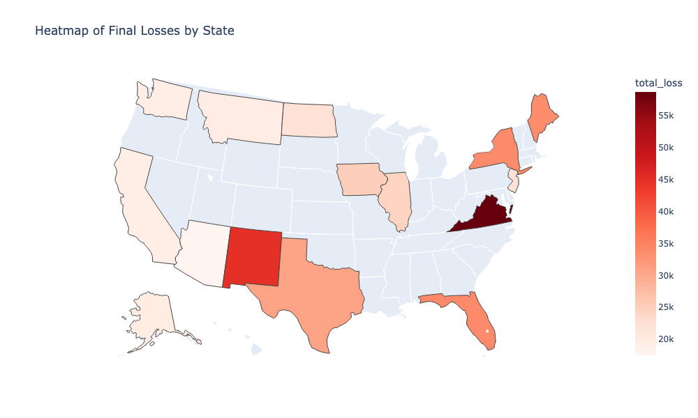
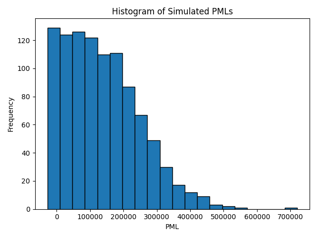

# Mortgage Reinsurance Probable Maximum Loss - Stochastic Loss Modelling Framework

## 1. Problem Motivation

Probable Maximum Loss (PML) is an imprtant metric in evaluating and monitoring the portfolios of mortgage insurance/reinsurance treaties. They represent extreme losses a (re)insurer may face under adverse scenarios. Estimating PML is challenging due to:
- Dependence of defaults on borrower characteristics like credit scores and loan-to-value ratios
- Dependence of severity of losses on macro-economic drivers like house prices
- Uncertainty in loss severity and recoveries
- Long-term multi-year treaties requiring understanding of loss and premium development over time

This engine uses user assumptions on defaults and house price to simulate PML under different scenarios. The engine acts as a tool for the user to take an excel interface to give inputs and look at outputs, while the calculations happen at the backend in python. 

---

## 2. Objective

To develop a Python based tool that helps actuaries or underwriters estimate Probable Maximum Loss (PML) on mortgage reinsurance treaties under various stress scenarios.

---

## 3. Modelling Approach

### Loan Level Loss Modelling
- Default probabilities derived from FICO/LTV grids
- Claim severity modelled as the minimum of:
    - MI coverage-based loss, and
    - Property value-adjusted recoveries
 
---

### Cashflow Modelling
- Premium and Loss emergence patterns applied over treaty duration
- Incorporation of treaty features like profit commission, reinsurance margin, expenses, and treaty loss ratio caps
- Aggregation of underwriting results to estimate total losses

---

### Stochastic Simulation
- Monte Carlo simulation of key drivers:
    - House Price Index
    - Expense Loadings
    - Default rates by FICO/LTV grid
- Generation of PML distribution and percentile estimates

---

## 4. Results & Visualisation

### Average Loss from each State to show key risk areas

Total losses are concentrated in Virginia, New Mexico, Texas, New York and Florida, reflecting a combination of portfolio size and higher-risk loan characteristics in those states.

### PML Histogram

The PML distribution is right-skewed with most simulated values clustering below $200,000. The long tail reflects scenarios where adverse HPI movements and high default rates coincide, driving extreme losses.

---

## 5. Key Insights

- PML estimates are highly sensitive to joint movements in default rates and house prices, highlighting the importance of modelling parameter uncertainty
- Deterministic assumptions can significantly underestimate tail risk, particularly under adverse HPI scenarios
- Portfolio composition (FICO/LTV mix) is a primary driver of loss concentration

---

## 6. Documentation

A detailed step-by-step explanation of the model, inputs, and outputs along with the limitations is provided in **[Documentation_MortgageReinsurance_PML](https://drive.google.com/file/d/1ceFMN5gTWdDX1-OXLYCBbv7S7rEArIO7/view?usp=sharing)** present in this repository.

---

## 7. Repository Structure

- `01_MortgageReinsurance_PML` — Core python engine  
- `Input Files` — Assumptions and loan level data  
- `Output Files` — PML results and simulations  
- `Documentation` - Detailed model explanation

---

## 8. Takeaway

This project highlights how incorporating stochasticity into mortgage loss modelling materially changes the understanding of tail risk, making it critical for pricing and risk management of reinsurance treaties.

---

## Libraries

`numpy` `pandas` `matplotlib` `openpyxl` `xlsxwriter` `seaborn`  

